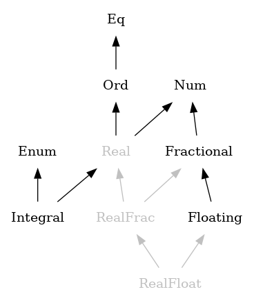
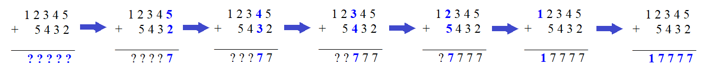
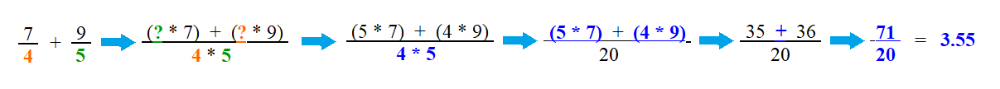
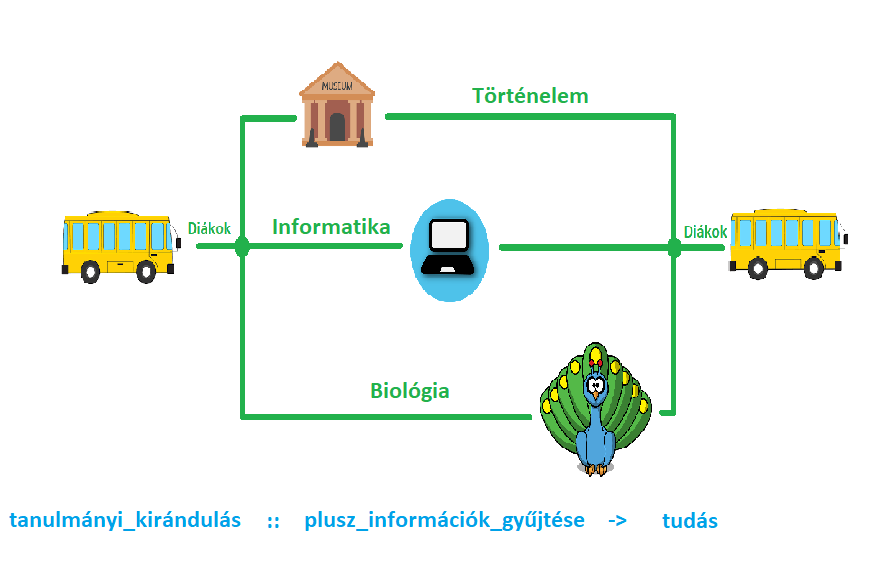
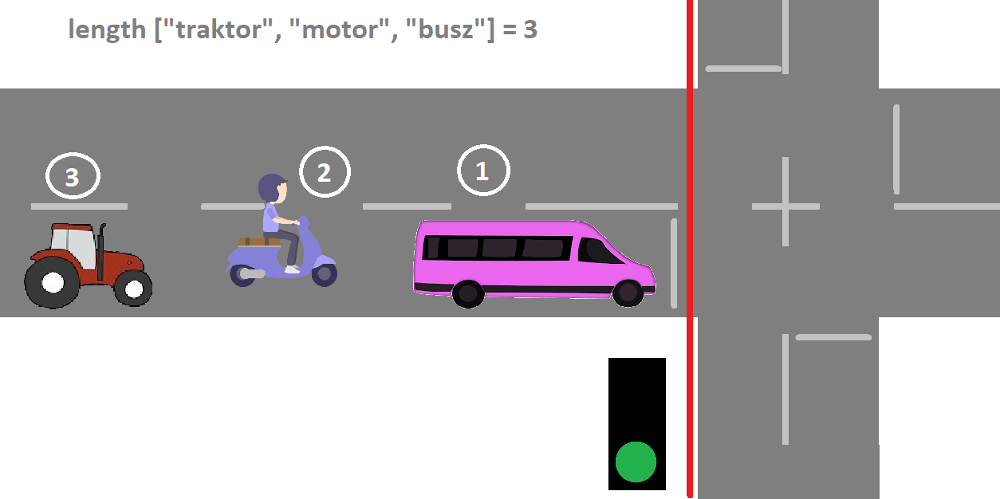

#Polimorfizmus

Haskell esetében a polimorfizmusnak (többalakúság) két változatát különböztetjük meg, az ad-hoc (constrained) és a parametrikus (parametric) polimorfizmust.

Bevezetésképpen nézzük meg az alábbi video első 38 másodpercét:
https://www.youtube.com/watch?v=Yw-PPjGPPLg
Ezek szerint Pom-Pom is egy polimorf élőlény lenne? `:)`

##Polimorf számliterálok
Mielőtt jobban elmélyednénk a polimorf függvények világában, tegyünk egy kisebb kitérőt a polimorf számliterálok felé.

```haskell
Prelude> :t 5
5 :: Num p => p

Prelude> :t 3.21
3.21 :: Fractional p => p

Prelude> :t 0xBA20B
0xBA20B :: Num p => p

Prelude> :t pi
pi :: Floating a => a
```
Az fentebb leírt típuslekérdezések eredménye triviális, azt a típusdefiníciót kaptuk, amire számítottunk. Most nézzünk pár példát arra, hogy hogyan változik meg a típus lekérdezésének eredménye, ha eltérő típusokkal egyszerű műveleteket szeretnénk végezni.

```haskell
Prelude>  :t 213 + 76.5
213 + 76.5 :: Fractional a => a

Prelude> :t 3 * pi
3 * pi :: Floating a => a

Prelude> :t pi - 2.1999 
pi - 2.1999 :: Floating a => a
```
Tudjuk, hogy Haskellben aritmetikai műveleteket csak azonos típusú értékekkel végezhetünk el. Mi lehet az oka annak, hogy a fenti példák mégis típus helyesek lesznek? Vegyük észre, hogy - noha a műveletek során mindkét paraméter eltérő típussal rendelkezik, - a lekérdezést követően már csak az egyik paraméter típusát kapjuk eredményül, a másik "eltűnik".

```haskell
div :: Integral a => a -> a -> a
mod :: Integral a => a -> a -> a
(/) :: Fractional a => a -> a -> a

6 `div` 3 :: Integral a => a
Prelude> 6 `div` 3
2

120 `div` 13 :: Integral a => a
Prelude> 120 `div` 13
9

120 `mod` 13 :: Integral a => a
Prelude> 120 `mod` 13
3

10 / 5 :: Fractional a => a
Prelude> 10 / 5
2.0
```
Noha a (/) függvény a definíciója szerint tört számot vár paraméterül, ennek ellenére egész számmal meghívva is ad eredményt. Ugyanakkor ha a ``div`` vagy ``mod`` függvényeket egész számok helyett tört számokkal hívjuk meg, hibát kapunk.

```haskell

Prelude> 12.5 `div` 3.2
<interactive>:45:1: error:
    * Ambiguous type variable [...]
```
Lássuk mi is történik ilyenkor.
```haskell
(+) :: Num a => a -> a -> a
```
Amikor meghívunk egy függvényt, akkor a fordító először leellenőrzi, hogy a kapott kifejezés típushelyes-e. A ``213 + 76.5`` hívás esetén a ``(+)`` definíciója megadja, hogy a függvény két ``Num a`` típusú paramétert vár, ahol a ``Num``-t típusosztálynak, az ``a``-t pedig típusváltozónak nevezzük. Az azonban nem derül ki a függvény definíciójából, hogy ez a ``Num`` érték konkrétan ``Word``, ``Integer``, ``Int``, ``Float`` vagy ``Double`` értéket jelent. Amikor paraméterül adjuk a ``213``-at és a ``76.5``-öt, akkor a fordító először nem tudja, hogy ezek a számok milyen típusú értékeket takarhatnak.

<div id="img1">
  
</div>

A függvény definíciója szerint a kapott paramétereknek azonos típusúnak kell lenniük, a fordító pedig leellenőrzi, hogy a paraméterek megfelelnek-e ennek a feltételnek. Mivel a ``213`` önmagában a ``Num`` bármelyik típusának megfelelhet a fentebb felsoroltak közül, a ``76.5`` azonban csak a ``Float`` és a ``Double`` típusoknak, ezért a fordító csak akkor tudja típushelyesként értelmezni a kifejezést ha mindkét paramétert ``Double`` vagy mindkettőt ``Float`` típusúnak tekinti.

Mivel a ``Fractional`` osztály lényegében a ``Num`` osztálynak  egy olyan alosztálya, amelybe többek között ``Float`` vagy ``Double`` típusú értékek is tartoznak, a fordító talált egy olyan értelmezési módot, amely eleget tesz a függvény definíciójában szereplő összes megkötésnek, tehát innentől kezdve a kifejezést típushelyesnek fogja tekinteni, a típusa pedig a következő lesz:

```haskell
Prelude>  :t 213 + 76.5
213 + 76.5 :: Fractional a => a
```
Ugyanez az oka annak, hogy látszólag egész számot össze tudunk szorozni egy törtszámmal, vagy hogy a paraméterként törtszámot váró (/) függvény látszólag egész számokkal is képes végrehajtani a kért műveletet.
A ``12.5 `div` 3.2`` hívás esetén azért nem működik ugyanez a folyamat, mert a ``div`` függvény ``Integral a`` paramétereket vár, azonban az ``Integral`` osztályba ``Word``, ``Integer`` és ``Int`` típusú értékek tartoznak és ennek a kritériumnak nem felel meg sem a ``12.5``, sem a ``3.2``. A fordító csak abban az esetben fogja típushelyesként kezelni a kifejezést, ha minden eleme megfelel az elvárt feltételeknek. Ha a kifejezés tartalmaz olyan elemet, amely ezt az elvárást nem teljesíti, a fordító hibával jelzi a problémát.

Amennyiben előre tudjuk, hogy pl. az ``568``-as számot még véletlenül sem szeretnénk ``Int`` típusúként használni és azt szeretnénk, ha a fordító ezt ``Double`` értékként kezelni, lehetőségünk van a paramétert specializálni az alábbi módon:

```haskell
568 :: Double

Prelude> :t 568::Double
568::Double :: Double
```
Fontos kiemelni, hogy ilyenkor nem konverzió történik, hanem a megadott érték eleve ``Double`` típusúként jön létre.

##Ad-hoc polimorfizmus
Egy függvényt akkor nevezünk ad-hoc polimorfnak, ha több különböző megvalósítása is létezik attól függően, hogy milyen típusú paraméterekkel kell dolgoznia.

```haskell
sum' :: Num a => a -> a -> a
sum' x y = x + y
```

Tipikus példa erre az összeadás. Ilyenkor a legtöbb embernek a matematika órák jutnak eszébe, ahol egész számokat vagy tört számokat adunk össze, az eredmény pedig szintén egy szám lesz. Azonban egyáltalán nem mindegy, hogy ez az összeadás hogyan történik. 

```haskell
*Main> sum' 12345 5432
17777
```

<div id="img1">
  
</div>


Ha egész számokat szeretnénk összeadni, akkor ezt a műveletet helyiértékek szerint végezzük. Először összeadjuk az egyes helyiértéken található számokat, utána a tízes helyiértéken lévő számokat, és így tovább. Ha jól végeztük dolgunkat, akkor jutalmul megkapjuk a 2 szám összegét.

```haskell
*Main> sum' (7/4) (9/5)
3.55
```
<div id="img1">
  
</div>

Ezzel szemben ha tört számokkal szeretnénk dolgozni, akkor a helyiérték alapú összeadás már nem működik. Ahhoz, hogy két törtet össze tudjunk adni, először közös nevezőre kell hozni őket, a számlálókat majd csak ez után adhatjuk össze.

Mindkét esetben 2 szám összegét szeretnénk meghatározni, de ugyanazt a műveletet mégis teljesen másképp kell végrehajtani. 

Nézzünk meg egy másik példát is. Képzeljük el egy végzős gimnáziumi osztályt, ahol a diákok éppen az érettségire készülnek. Tegyük fel, hogy a felkészülés részeként egy egész napos tanulmányi kirándulásra indulnak Budapestre. Az osztályban lévő diákok érdeklődési köre meglehetősen szerteágazó: vannak akiket a történelem, másokat a nyelvek, megint másokat pedig éppenséggel a matematika vagy az informatika érdekel. Annak érdekében, hogy minden diák az érdeklődésének megfelelő területen tudjon tapasztalatot gyűjteni, fakultációk szerint eltérő programokat szerveztek maguknak. A történelem iránt érdeklődők a Hadtörténeti Múzeumot, a biológiából érettségizők a Fővárosi Állat- és Növénykertet, míg az informatikus jelöltek az Infoparkot látogatják meg. A nap folyamán mindenki a fakultációjának megfelelő programon vesz részt, majd megadott időben visszatérnek a megbeszélt találkozó helyre és közösen haza indulnak.

<div id="img1">
  
</div>

Ebben az esetben a cél az érdeklődésnek megfelelő tapasztalatszerzés. Ugyanaz a kiinduló pont (közös utazás után egy helyről indulnak), mindenki végrehajtja a számára kijelölt műveletet (érdeklődési körtől függően plusz információ gyűjtése az adott területről), majd ugyanoda érkeznek vissza (gyülekező a megbeszélt találkozási pontnál és közös utazás haza), mégis teljesen más útvonalat járnak be. 

Az ad-hoc polimorf függvények úgy vannak megírva, hogy minden típusra, amivel dolgozni tudnak, külön, egyenként definiálva van a függvény viselkedése. Térjünk vissza az első példánkhoz, az összeadáshoz. Az eredmény minden esetben az elvégzett művelet végeredménye lesz, de más-más algoritmus fog lefutni akkor, ha ``Int`` típusú elemekkel, más ha ``Integer`` és megint más ha pl. ``Double`` értékekkel dolgozunk. A függvény típusából, illetve a kapott paraméterből a program kitalálja, hogy milyen típussal kell dolgoznia és az annak megfelelő implementációt fogja lefuttatni.


Mi történik azonban, ha valaki két szöveget szeretne "összeadni"?

```haskell
*Main> sum' "Has" "kell"
 error:
    * No instance for (Num [Char]) arising from a use of sum'
    * In the expression: sum' "Has" "kell"
      In an equation for `it': it = sum' "Has" "kell"
```

A hagyományos, számokra értelmezett összeadás betűkkel, szövegekkel nyilvánvalóan nem fog működni, ugyanis a ``sum'`` függvényben felhasznált ``(+)`` függvény ``Num`` típusosztályba tartozó számokat vár paraméterül, egy ``Char`` vagy ``String`` típusú paraméterrel egyszerűen nem tud mit kezdeni. ``Char`` vagy ``String`` paraméter esetén a fordító - mivel nem típushelyes a kifejezés - hibát dob. Ugyanúgy, mint amikor a kiránduláson a horgászás sem szerepelt a választható programok között. Két szöveg egyesítését egy másik művelet, az összefűzés ``(++)`` segítségével oldhatjuk meg, de számokkal ugyanez a függvény már nem fog működni.

```haskell
(++) :: [a] -> [a] -> [a]

*Main> "Has" ++ "kell"
"Haskell"
```

Általánosságban elmondhatjuk, hogy azok a függvények lesznek ad-hoc polimorf függvények, amelyeknek a típus definíciójában típusosztályok, illetve típus megkötések, megszorítások szerepelnek. A típus definícióból egyértelműen kiderül, hogy az adott függvény milyen eszköztárral dolgozhat, milyen megkötések vonatkoznak rá.

##Paraméteres vagy parametrikus polimorfizmus

Egy függvény akkor parmetrikus, ha csak egyféle megvalósítása létezik. A parametrikus függvények sokkal általánosabban értelmezhetők, mint az ad-hoc függvények, emiatt lényegében több paraméter típussal is működik ugyanaz a megvalósítás.

Tegyük fel, hogy a BKV az iskolákkal egyeztetve diákmunkát hirdet. A jelentkező diákok egy tanítási napon reggel 8 és délután 4 között forgalom-, vagy utasszámlálást végeznek egy adott útszakaszon, illetve a kijelölt buszjáratokon.

Akik forgalomszámlálásra jelentkeznek, azt a feladatot kapják, hogy egy belvárosi főúton számolják meg, hogy 1-1 zöld jelzés alatt hány jármű tud áthajtani az adott kereszteződésen, majd a kapott számot jegyezzék fel egy előre elkészített táblázatba.

<div id="img1">
  
</div>

Azoknak a diákoknak, akik az utasszámlálást választották, azt kell felírni, hogy az adott megállóhelyen hány utas száll fel a buszra. Feltételezzük, hogy felszálásra csak az első ajtót szabad használni és hogy az utasok betartják a szabályokat.

A kapott számokat összeadva megkapjuk, hogy munkaidőben hányan közlekednek egy adott útvonalon, illetve hogy ugyanebben az időszakban mekkora a buszok kihasználtsága.

Mindkét esetben a feladat lényege az előre meghatározott elemek megszámlálása. A feladat szempontjából lényegtelen, hogy teherautó, személyautó vagy motorkerékpár hajtott át a kereszteződésen (mindegyik járműnek minősül), az utasoknál pedig nem számít, hogy fiatal, idős, férfi, nő vagy gyerek szállt fel a buszra, a lényeg, hogy az adott típusú elem - jelen esetben jármű vagy személy -  megszámlálásra kerüljön.

Parametrikus függvény pl. az alábbi, az eredetihez képest némileg egyszerűbb formában definiált length függvény, ami egy lista hosszát, illetve a benne lévő elemek számát adja meg.:

```haskell
length' :: [a] -> Int 
```

A length függvény számára nem érdekes, hogy egy ``Int`` lista elemeinek mi a konkrét értéke, vagy hogy milyen karakterekből áll össze a kapott ``String``. A függvénynek csak az számít, hogy a kapott listában azonos típusú elemek legyenek, ezen felül neki csak az elemeket kell megszámolnia, az értékével nem foglalkozik. Ugyanaz fog történni a háttérben ha ``String`` listát, ``Int`` listát vagy ``Bool`` listát adunk paraméterül. Ennélfogva a length hívásakor függetlenül attól, hogy mi a lista elemeinek a típusa, mindig ugyanaz az algoritmus (elemeket számláló) fog lefutni és nem kell a különböző típusú elemekhez más-más algoritmust létrehozni.


##Gyakorló feladatok

###1. Feladat:
Az alábbi függvények közül melyek esetén beszélhetünk polimorfizmusról?

```haskell
1)  negate :: Num a => a -> a
2)  sqrt :: Floating a => a -> a
3)  fst :: (a, b) -> a
4)  True :: Bool
5)  Just :: a -> Maybe a
6)  min :: Ord a => a -> a -> a
7)  (||) :: Bool -> Bool -> Bool
8)  unzip :: [(a, b)] -> ([a], [b])
9)  digitToInt :: Char -> Int
10) reverse :: [a] -> [a]

```

###2. Feladat:
Az alábbi függvények közül melyek lesznek ad-hoc polimorfak?
```haskell
1)  (*) :: Num a => a -> a -> a
2)  nub :: Eq a => [a] -> [a]
3)  id :: a -> a
4)  last :: [a] -> a
5)  minimum :: Ord a => [a] -> a
6)  zip :: [a] -> [b] -> [(a,b)]
7)  (!!) :: [a] -> Int -> a
8)  drop :: Int -> [a] -> [a]
9)  delete :: Eq a => a -> [a] -> [a]
10) sort :: Ord a => [a] -> [a]
```

###3. Feladat
Az alábbi függvények közül melyek lesznek parametrikusan polimorfak?

```haskell
1)  tail :: [a] -> [a]
2)  group :: Eq a => [a] -> [[a]]
3)  (==) :: Eq a => a -> a -> Bool
4)  round :: (RealFrac a, Integral b) => a -> b
5)  (++) :: [a] -> [a] -> [a]
6)  last :: [a] -> a
7)  sum :: (Foldable t, Num a) => t a -> a
8)  flip :: (a -> b -> c) -> b -> a -> c
9)  show :: Show a => a -> String
10) zipWith :: (a -> b -> c) -> [a] -> [b] -> [c]

```

###Megoldások
1. Feladat: 1, 2, 3, 5, 6, 8, 10
2. Feladat: 1, 2, 5, 8, 9, 10
3. Feladat: 1, 5, 6, 8, 10

##Polimorfizmus: Függvény vagy paraméter?

A polimorfizmus témakörének megközelítése nem feltétlenül egységes.

A fentiekben a polimorfizmust elsősorban függvényekre értelmeztük és az ad-hoc polimorfizmusra úgy tekintettünk, mint  a parametrikus polimorfizmusnak egy speciális részhalmazára. Ebben az esetben azokat a függvényeket tekintettük parametrikusan polimorfnak, amelyek típusváltozóval rendelkeznek, ad-hocnak pedig azokat, amelyeknek a típusában típusmegkötés szerepelt. Tehát minden ad-hoc polimorf függvény egyben parametrikusan polimorf is, de nem minden parametrikusan polimorf függvény ad-hoc polimorf is egyben.

Ezzel szemben létezik egy másik szemlélet is, amely a polimorfizmus kérdését a paraméterek felől közelíti meg és eszerint az ad-hoc, illetve a parametrikusan polimorf változók olyan egyenrangú halmazoknak tekinthetőek, amelyeknek van közös metszéspontjuk. Ebben a szemléletben léteznek tisztán ad-hoc paraméterek, tisztán polimorf paraméterek és olyan paraméterek is, amelyek egyszerre tekinthetőek ad-hoc-nak és parametrikusnak.

Természetesen mind a két szemléletet lehet paraméterek és függvények szintjén is értelmezni.

```haskell
genericLength :: Num i => [a] -> i
```

Az első szemlélet szerint a ``genericLength`` a függvények szintjén egyértelműen ad-hoc-nak számít, mivel tartalmaz típusmegkötést. Paraméterek szintjén viszont a paramáterként kapott lista parametrikusan polimorf, míg a visszatérési érték ad-hoc.

 A második szemlélet a paraméterek szintjén megegyezik az elsővel. Ha függvények szintjén vizsgáljuk a ``genericLength``-t, akkor nem lehet egyértelműen kijelenteni, hogy ad-hoc vagy parametrikus függvényről van szó, mert mindkettőre akad példa a függvényen belül.

##Kitekintés
Más programozási nyelvekben a polimorfizmus jelenségét leginkább a ``Templates``-nek vagy ``Generics``-nek tudjuk megfeleltetni. Ezek a nyelvi elemek nem azonosak a polimorfizmussal, de sok tekintetben hasonlítanak rá, ezért könnyű párhuzamot vonni közöttük.

C++-ban az alábbi módon tudjuk ezt jelölni:
```C++
template <class T>
class MyTemplateClass{
  private:
    T _value;
  public:
    T getValue() { return _value; }
    void setValue(T value) { _value = value; }
};
``` 

Ilyenkor a MyTemplateClass-t több eltérő típusú értékkel is létre tudjuk hozni. Ha stringgel példányosítjuk, akkor T string értéket fog jelölni. Ha int-tel példányosítjuk, akkor T int értéket fog jelölni.

Javaban és C#-ban is hasonlóan működik a dolog, ott azonban ``Templates`` helyett ``Generics``-et használunk.

## Felhasznált irodalom

Christopher Allen, Julie Moronuki: Haskell Programming from First Principles
http://lambda.inf.elte.hu/Index.xml
http://learnyouahaskell.com/chapters
https://eli.thegreenplace.net/2018/return-type-polymorphism-in-haskell/ 
https://dev.to/jvanbruegge/what-the-heck-is-polymorphism-nmh
https://www.cs.toronto.edu/~lczhang/324/lab/lab09.pdf
http://www.haskellforall.com/2015/10/polymorphism-for-dummies.html
https://andrew.gibiansky.com/blog/haskell/haskell-typeclasses/
